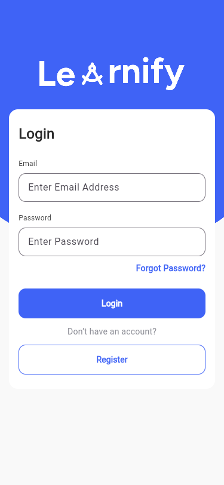
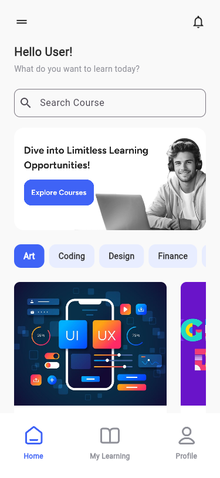
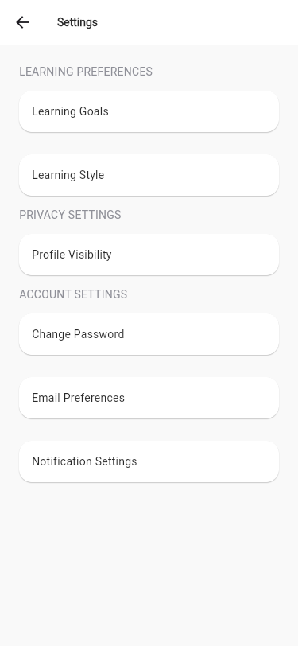

# Learnify

Learnify is a modern Flutter application designed for online learning. It features a clean UI/UX for browsing courses, managing profiles, and tracking learning progress.

## Downloads

You can download the latest Android build directly from this repository:

- [**Download Android APK**](releases/learnify_android.apk)

For iOS, you can download the IPA artifact from the [GitHub Actions](https://github.com/your-username/learnify/actions) page after a build completes.

## Screenshots

    
    
    
    

## Getting Started

This project is a starting point for a Flutter application.

A few resources to get you started if this is your first Flutter project:

- [Lab: Write your first Flutter app](https://docs.flutter.dev/get-started/codelab)
- [Cookbook: Useful Flutter samples](https://docs.flutter.dev/cookbook)

For help getting started with Flutter development, view the
[online documentation](https://docs.flutter.dev/), which offers tutorials,
samples, guidance on mobile development, and a full API reference.
